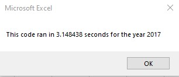
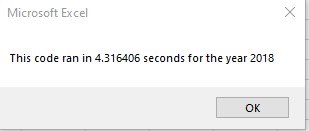
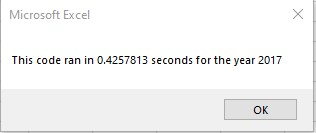
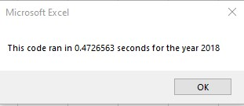
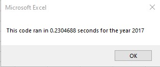
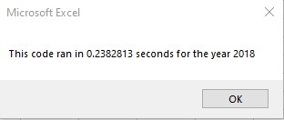

# stock-analysis
 <!---- Utilize VBA to analyze stock data --->

## Overview of Project

<!--- Overview of Project: Explain the purpose of this analysis. --->

Steve loves the workbook that was prepared for him. At the click of a button, he can analyze an entire dataset. Now, to do a little more research for his parents, he wants to expand the dataset to include the entire stock market over the last few years. While the current solution works well for a dozen stocks, it might not work as well for thousands of stocks. And if it does, Steve wonders if it may take a long time to execute.

Steve has tasked us with expanding the solution to include all stocks that Steve would like to analyze. Steve has also asked us to analyze the performance traits of the solution in it's original format and in the newly re-factored format.

Steve asked that the solution create an output table which prints a line per ticker for the following values:

- Total volume traded for the year
- The return on investment for the year 

The output will also show if the return on investment is positive or negative for the year by coloring the cell of the table either green or red. 

##2017 Output

The analysis of the 2017 stock tickers produced the following output:

The output table shows the following:

- most of the stocks made money
- half the stock making over 50% return on value 
- Only one stock lost money 

##2018 Output

The analysis of the 2018 stock tickers produced the following output:

The output table shows the following:

- most of the stocks lost money
- one third of the stock lost over 40% of value
- Only two stock made money 

## Results

<!--- Results: Using images and examples of your code, compare the stock performance between 2017 and 2018, as well as the execution times of the original script and the re-factored script. --->

###Original Macro
The original macro was built to utilize variables for everything. 

<code>

 	'Initialize variables
    
    totalvolume = 0
    rowstart = 2
    rowEnd = 0
    
    ' Set up variables
    
    Dim startTime, endTime As Single
    
    Dim printrow As Integer
    Dim startingprice, endprice As Double
    Dim ticker, printcell, yearVal As String
</code>

The solution would sort the datset so that the ticker names are in order, then read the dataset line by line and determine if the current line is part of the current ticker set or not, and then update the appropriate variables. 

<code>
 
	'Sort the tickers in the table
    
    Range("A5", Range("A1").End(xlDown)).Sort key1:=Range(printcell), Order1:=xlAscending
    	
	'5) loop through rows in the data
    
    For i = rowstart To rowEnd

      '3b) Activate data worksheet
      Worksheets(yearVal).Activate
       
      '4) Loop through tickers
      If Cells(i, 1) = ticker Then
       
        '5a) Get total volume for current ticker
        ' Increase totVolume
        totalvolume = totalvolume + Cells(i, 8).Value
      
        '5b) get starting price for current ticker
        'Figure out starting price
        If Cells(i, 1).Value = ticker And Cells(i - 1, 1).Value <> ticker Then
        
          startingprice = Cells(i, 6).Value
        
        End If
</code>

####Performance to Analyze 2017 data

####Performance to Analyze 2018 data

###Original Macro + an Array for ticker
As the solution was being tested, an array was introduced for the list of stock tickers to be analyzed. One drawback of this solution is you have to know the list of stock tickers beforehand for analysis. The solution would sort the datset so that the ticker names are in order, then read the dataset line by line and determine if the current line is part of the current ticker set or not, and then update the appropriate variables. 

<code>

	' Initialize variables
	    
    totalvolume = 0
    rowstart = 2
    rowEnd = 0
    
    ' Set up variables
    
    Dim startTime, endTime As Single
    
    Dim printrow As Integer
    Dim startingprice, endprice As Double
    Dim printcell, ticker, yearVal As String
    Dim tickers(11) As String

	'2) Initialize ticker array
        
    tickers(0) = "AY"
    tickers(1) = "CSIQ"
    tickers(2) = "DQ"
    tickers(3) = "ENPH"
    tickers(4) = "FSLR"
    tickers(5) = "HASI"
    tickers(6) = "JKS"
    tickers(7) = "RUN"
    tickers(8) = "SEDG"
    tickers(9) = "SPWR"
    tickers(10) = "TERP"
    tickers(11) = "VSLR"

</code>

<code>

	'Sort the tickers in the table	
	Range("A5", Range("A1").End(xlDown)).Sort key1:=Range(printcell), Order1:=xlAscending
    
    '5) loop through rows in the data
    
    For J = 0 To 11

        '3b) Activate data worksheet
        Worksheets(yearVal).Activate
              
        '2a) Update ticker to the next value
        ticker = tickers(J)
        
        For i = rowstart To rowEnd
   
          '4) Loop through tickers
          If Cells(i, 1) = ticker Then
</code>

####Performance to Analyze 2017 data

####Performance to Analyze 2018 data

###Refactored Macro
As the solution was being tested, an array was introduced for the list of stock tickers to be analyzed. One drawback of this solution is you have to know the list of stock tickers beforehand for analysis. The solution would sort the datset so that the ticker names are in order, then read the dataset line by line and determine if the current line is part of the current ticker set or not, and then update the appropriate variables.

<code>

	Dim startTime As Single
    Dim endTime  As Single
    Dim printrow, tickerindex As Integer
    Dim printcell As String
    
	'1b) Create three output arrays
    Dim tickervolume(11) As Double
    Dim tickerstartingprices(11) As Single
    Dim tickerendingprices(11) As Single
        
</code>

<code>

	Range("A5", Range("A1").End(xlDown)).Sort key1:=Range("A5"), Order1:=xlAscending

    tickerindex = 0
    
    ''2b) Loop over all the rows in the spreadsheet.
        For i = 2 To RowCount
                
            '3a) Increase volume for current ticker
            
            tickervolume(tickerindex) = tickervolume(tickerindex) + Cells(i, 8).Value
            
            
            '3b) Check if the current row is the first row with the selected tickerIndex.
            If Cells(i, 1).Value = tickers(tickerindex) And Cells(i - 1, 1).Value <> tickers(tickerindex) Then
                
                tickerstartingprices(tickerindex) = Cells(i, 6).Value
                
            End If

</code>

####Performance to Analyze 2017 data

####Performance to Analyze 2018 data

##Summary
<!--- Summary: In a summary statement, address the following questions.
What are the advantages or disadvantages of re-factoring code?
How do these pros and cons apply to re factoring the original VBA script? ---> 
